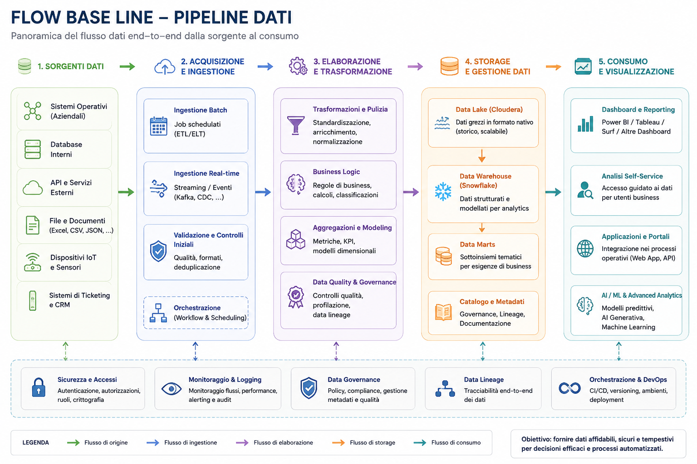

# Databricks-vs-Data-Lake-vs-Cloudera

# Databricks vs Data Lake vs Cloudera

## 1. Data Lake 🗄️

A **Data Lake** is a storage system used to store large amounts of raw data in its original format.

### Key Features:

* Stores raw data (structured, semi-structured, unstructured)
* No strict schema required
* Can store files like CSV, JSON, images, videos, logs

### Main Idea:

👉 Store everything first, analyze later

### Example:

A company stores all user activity logs, images, and transaction data in one place without processing it first.

---

## 2. Databricks ⚙️

Databricks is a **cloud-based data platform** used for data engineering, analytics, and machine learning.

### Key Features:

* Built on Apache Spark
* Data processing and transformation (ETL)
* Machine learning and AI workflows
* Supports SQL, Python, and notebooks
* Works with cloud platforms (AWS, Azure, GCP)

### Main Idea:

👉 Turn raw data into insights and AI models

### Example:

Processing data from a Data Lake, cleaning it, and training a machine learning model to predict customer behavior.

---

## 3. Cloudera 🟦

Cloudera is a **big data platform** based on the Hadoop ecosystem, often used in enterprise environments.

### Key Features:

* Built on Hadoop ecosystem (HDFS, Hive, etc.)
* Supports on-premise and cloud deployments
* Strong security and governance tools
* Can integrate Spark for processing

### Main Idea:

👉 Manage and process big data in enterprise environments with full control

### Example:

A bank uses Cloudera to store and process large volumes of transaction data securely within its own infrastructure.

---

## ⚔️ Key Differences

| Feature       | Data Lake      | Databricks             | Cloudera                |
| ------------- | -------------- | ---------------------- | ----------------------- |
| Type          | Storage system | Data platform          | Big data platform       |
| Purpose       | Store raw data | Process & analyze data | Manage big data systems |
| Processing    | Minimal        | Advanced (Spark)       | Hadoop + Spark          |
| Deployment    | Cloud storage  | Cloud-first            | On-premise + cloud      |
| AI/ML Support | No             | Strong                 | Limited (traditional)   |

---

## 🧠 Simple Analogy

* **Data Lake** = A big warehouse storing all raw materials
* **Cloudera** = A traditional factory managing data inside a controlled system
* **Databricks** = A smart modern factory that transforms data into AI products

---

## 🔥 Summary

* Data Lake → Stores everything
* Cloudera → Traditional big data management system
* Databricks → Modern AI + data processing platform

---

If you want, I can also add:

* Architecture diagrams
* Real-world company use cases
* Or a learning roadmap for data engineering 🚀
